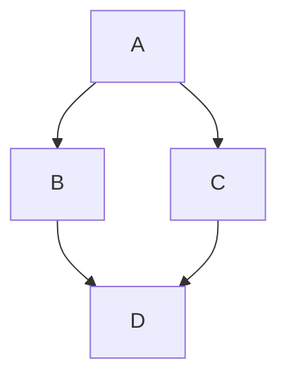

# MarkdownEditor

A native Markdown editor with live preview, syntax highlighting, Mermaid diagram support, and image drag-and-drop. Available for macOS and Windows.


## Features

- **Three-pane layout** — Sidebar (file browser) | Editor (source) | Preview (rendered HTML)
- **Live preview** — Markdown renders in real time as you type; full HTML template with dark/light mode support
- **Syntax highlighting in editor** — Headers, bold, italic, code, links, blockquotes, strikethrough, and images highlighted inline via `NSTextStorage`; dark/light palette resolved at highlight time without static side channels
- **Mermaid diagrams** — ````mermaid``` blocks render as SVG diagrams in the preview using [Mermaid](https://mermaid.js.org/) (v10)
- **Code syntax highlighting in preview** — Fenced code blocks highlighted via [highlight.js](https://highlightjs.org/) (v11)
- **GFM rendering** — Tables, strikethrough, task lists, autolinks via [cmark-gfm](https://github.com/github/cmark-gfm) (with regex fallback when unavailable)
- **Image drag-and-drop / paste** — Drag images from Finder or paste from clipboard; embedded as base64 data URIs for self-contained `.md` files
- **File browser sidebar** — Browse all `.md` files in a folder recursively; correct deep-directory hierarchy preserved (3+ levels)
- **Multi-window** — Cmd+Shift+N opens a new window, each with independent state
- **Session restore** — Last opened file is restored on next launch automatically
- **External change detection** — Prompts to reload when a file is modified by another app; path prefix comparison correctly scoped to the folder boundary
- **Line numbers** — Gutter with line-boundary enumeration (not character-by-character scan) for large files
- **Search & Replace** — Cmd+F opens floating search panel with match navigation (▲/▼) and replace support; preserves user's current match index across searches; works in both editor and preview-only mode
- **Preview search** — Preview-only mode overlay with independent search state
- **Outline panel** — Cmd+Shift+O shows a floating heading navigator; ignores headings inside fenced code blocks; click to scroll to section in preview
- **Preview-only mode** — Hide the editor pane for distraction-free reading; search bar overlay available; three preview widths (720px / 960px / full)
- **Preview width toggle** — Cycle through three content widths (`Cmd+W`) in preview-only mode: compact, wide, full-width centered
- **Folder management** — Open folders to browse their `.md` files recursively; right-click to close folders (no X button)
- **Apple Notes-like aesthetic** — Clean, minimal interface with system accent color

## Requirements

- macOS 14.0 (Sonoma) or later
- Apple Silicon (arm64) — Intel Macs are not currently supported

### Windows

- Windows 10 64-bit or later

## Installation

### Download DMG

1. Download the latest `MarkdownEditor.dmg` from the [Releases](https://github.com/your-org/MarkdownEditor/releases) page
2. Open the DMG and drag `MarkdownEditor.app` into your `Applications` folder
3. Right-click `MarkdownEditor.app` and select **Open** (first launch only — Apple Gatekeeper may block unsigned apps)

> [!NOTE]
> The app is ad-hoc code-signed. On first launch, you may need to right-click → Open to bypass Gatekeeper.

### Download EXE (Windows)

1. Download the latest `MarkdownEditor.exe` from the [Releases](https://github.com/your-org/MarkdownEditor/releases) page
2. Run the installer and follow the setup wizard

### Build from source (macOS)

```bash
# Clone the repository
git clone https://github.com/your-org/MarkdownEditor.git
cd MarkdownEditor

# (Optional) Install cmark-gfm for GFM table/strikethrough support
brew install cmark-gfm

# Build the .app bundle
bash build.sh

# (Optional) Package as DMG
bash package.sh
```

The built app will be at `MarkdownEditor.app` and the DMG at `MarkdownEditor.dmg` in the project root.

### Build from source (Windows)

The Windows version source code is located in `MarkdownEditor-windows/`. Open the solution file in Visual Studio and build, or run the build script in that directory.

## Usage

| Action | Shortcut |
|--------|----------|
| Open File | `Cmd+O` |
| Open Folder | (Sidebar button) |
| New Window | `Cmd+Shift+N` |
| Save | `Cmd+S` |
| Search | `Cmd+F` |
| Toggle Outline | `Cmd+Shift+O` |
| Toggle Preview Only | `Cmd+Shift+P` |
| Cycle Preview Width | `Cmd+W` |

### Search & Replace

1. Press `Cmd+F` to open the floating search panel — matches highlight in both editor (NSTextView background) and preview (DOM `<mark>` elements)
2. Type your query — your current match position is preserved across successive searches
3. Navigate with ▲/▼ buttons or `Enter`/`Shift+Enter`
4. Click **Replace** to expand the replace row
5. Use **Replace** or **Replace All** to modify text

### Mermaid Diagrams

````markdown

````

Mermaid diagrams render as SVGs in the preview pane. No external setup required — Mermaid is bundled with the app.

### Images

Drag an image from Finder into the editor, or copy an image from another app and paste with `Cmd+V`. Images are embedded as base64 data URIs, keeping the `.md` file fully self-contained.

## Project Structure

```
MarkdownEditor/
├── MarkdownEditor-windows/          # Windows version source code
├── Sources/
│   ├── MarkdownEditorApp.swift          # App entry, menu commands
│   ├── Models/
│   │   ├── AppState.swift               # Global state, caches, file operations
│   │   ├── FileTreeItem.swift           # File/directory tree model
│   │   ├── HeadingItem.swift            # Outline heading model
│   │   ├── LRUCache.swift               # Generic LRU cache for rendered HTML
│   │   ├── SearchState.swift            # Search logic, match tracking
│   │   └── ViewRefs.swift               # Weak references to editor/preview views
│   ├── Services/
│   │   ├── FileService.swift            # File I/O, directory scanning (recursive tree builder)
│   │   ├── FolderWatcher.swift          # FSEvents for external change detection
│   │   ├── HeadingParser.swift          # Markdown heading extraction (skips fenced code blocks)
│   │   ├── ImageHandler.swift           # Image drag/paste → base64 data URI
│   │   ├── MarkdownParser.swift         # Markdown → HTML (cmark-gfm + regex fallback)
│   │   ├── SearchJS.swift               # Shared JavaScript module for preview search highlighting
│   │   ├── SessionRestoreService.swift  # Bookmark-based session persistence
│   │   └── ThemeManager.swift           # Light/dark appearance management + applyTheme helper
│   ├── Views/
│   │   ├── ContentView.swift            # Root view, search/outline panel management
│   │   ├── InlineSearchView.swift       # Floating search panel (NSPanel)
│   │   ├── OutlinePanelView.swift       # Floating outline window
│   │   ├── ResizableHSplitView.swift    # Custom split view between editor/preview
│   │   ├── Editor/
│   │   │   ├── EditorContainerView.swift  # Editor entry point, loading overlay
│   │   │   ├── LineNumberSideView.swift   # Line number gutter (boundary enumeration)
│   │   │   ├── MarkdownTextStorage.swift  # NSTextStorage with inline highlighting
│   │   │   └── MarkdownTextView.swift     # NSTextView subclass with image support
│   │   ├── Preview/
│   │   │   ├── PreviewWebView.swift       # WKWebView management + WebView cache
│   │   │   └── PreviewSearchOverlay.swift # Preview-only search bar overlay
│   │   └── Sidebar/
│   │       ├── FileRowView.swift          # File list item
│   │       ├── FolderHeaderView.swift     # Folder header with right-click remove
│   │       └── SidebarView.swift          # File browser sidebar with folder tree
│   └── CCmarkGfm/
│       └── module.modulemap               # C interop module map for cmark-gfm
├── Resources/
│   ├── Assets.xcassets/                   # App icon assets
│   ├── mermaid.min.js                     # Mermaid diagram rendering
│   └── highlight.min.js                   # Code syntax highlighting in preview
├── build.sh                               # swiftc build script
├── package.sh                             # DMG packaging script
├── download_mermaid.sh                    # Mermaid download helper
├── generate_xcodeproj.rb                  # Xcode project generator
├── MarkdownEditor.icns                    # App icon
└── README.md
```

## Architecture

### Build system

The project uses a plain `swiftc` invocation via `build.sh` rather than Xcode. Source files are enumerated explicitly in the script, with `-O` optimization and macOS 14.0 target. An Xcode project can be generated via `generate_xcodeproj.rb` if needed.

```
build.sh → swiftc -O → .app bundle → codesign
```

### Rendering pipeline

```
User types in NSTextView
  → @Binding updates AppState.currentFileContent
    → onChange fires AppState.updateContent()
      → Debounced (200ms / 500ms for large files)
        → refreshOutline() on .utility queue (separate generation counter)
        → MarkdownParser.parseToHTML() on .userInitiated queue
          → cmark-gfm (preferred) or regex fallback
            → PreviewWebView.updateBodyViaJS()
              → WKWebView sets innerHTML, re-runs hljs + mermaid
              → SearchJS.highlight() re-applies search marks on content updates
```

### State management

All global state lives in `AppState`, marked with Swift 5.9 `@Observable`. No Combine or ObservableObject. SwiftUI views subscribe automatically through the observation framework.

Two monotonically increasing generation counters prevent stale async results:
- **HTML generation** — incremented on each file switch; background HTML results with a stale token are discarded
- **Outline generation** — separate counter prevents fast-typing race conditions where an old outline work item overwrites a newer one

### File loading & loading indicator

`AppState.loadFileContent()` follows a tiered strategy:
1. **In-memory content cache** — zero disk IO if previously loaded
2. **NSCache (HTML)** — memory-pressure aware, 20 entries, 30MB cost limit
3. **LRUCache (HTML)** — deterministic backup, 10 entries, survives NSCache eviction
4. **Disk read** — background queue, content shown immediately, HTML generated asynchronously

The `isLoadingFile` flag is correctly cleared on all code paths (cache hit, cache miss, and content-cache-hit-with-HTML-miss — the cache-hit/HTML-miss path was missing the `isLoadingFile = false` assignment).

### Outline parsing

`HeadingParser.parse()` skips headings inside fenced code blocks (``` and ~~~). The `buildTree()` function uses a tuple-based stack approach (`(item, children)`) rather than modifying `HeadingItem` value-types on the stack — since `HeadingItem` is a struct, in-place mutations on a stack copy wouldn't propagate back to the root array. A separate `outlineGeneration` counter prevents stale background results from overwriting fresh ones during fast typing.

### Caching

| Cache | Type | Limit | Notes |
|-------|------|-------|-------|
| File content | `[URL: String]` + access-order LRU | 20 entries | Zero disk IO on tab switch |
| HTML (primary) | `NSCache<NSURL, CachedHTML>` | 20 entries, 30MB | Purged under memory pressure |
| HTML (secondary) | `LRUCache<URL, CachedHTML>` | 10 entries | Survives NSCache eviction |
| WebView | Per-fileID dictionary | 10 entries | Preserves scroll position & JS state |
| Inline images | `NSCache<NSString, NSImage>` | 50 entries, 100MB | Avoids re-decoding base64 |

### Search highlighting (Preview)

Three UI entry points share a single `SearchJS` module for DOM-based search traversal:

- **InlineSearchView** — editor + preview search panel
- **PreviewSearchOverlay** — preview-only mode search bar
- **PreviewWebView.updateBodyViaJS** — re-applies marks on every body content update

The JavaScript walks text nodes via `document.createTreeWalker`, case-insensitively matches, wraps hits in `<mark class="search-result">`, supports a current-match highlight (`current-match` class + `scrollIntoView`), and returns match count via JSON. All three callers use the same `SearchJS.highlight(query:currentIndex:)` function, eliminating ~150 lines of duplicated JS. The `SearchPanel.close()` method uses `SearchJS.clearHighlights()` instead of constructing a broken JS string inline, fixing a truncated-script bug.

### Theme application

`ThemeManager` is the single source of truth for light/dark appearance:
- Reads `UserDefaults["themeMode"]` (`"system"`, `"light"`, `"dark"`)
- For `"system"` mode, returns `NSApp.effectiveAppearance` (`.dark`/`.light`) instead of `nil` — avoids a NavigationSplitView bug where the sidebar doesn't re-render when transitioning from an explicit value to `nil`
- Applies `NSApp.appearance` and posts `themeDidChange` notification
- `ThemeManager.applyTheme(textView:scrollView:lineNumberView:isDark:)` is a single static method used by both `MarkdownTextView.updateNSView` and the coordinator's `themeDidChange` observer, eliminating duplicate color-setup code
- Syntax highlighting colors accept `isDark` as a parameter directly instead of reading a static side channel (`_forceDarkMode` was removed)
- Both `MarkdownTextView.Coordinator` and `PreviewWebView.Coordinator` track `lastAppliedIsDark` to deduplicate theme application — when the user switches themes, the notification observer and SwiftUI's `updateNSView` both fire; `lastAppliedIsDark` ensures `rehighlightAll()` and `injectTheme()` run only once per actual change

### Directory tree building

`FileService.scanDirectory()` uses `FileManager.enumerator` with a recursive `appendToTree()` function instead of a flat children array lookup. The root `FileTreeItem` is initialized with `children: []` so that `children?.append()` is effective. This correctly handles files nested 3+ levels deep. When external file changes are detected, `AppState.insertInTree()` inserts new files into the correct hierarchical position without flattening the tree (the previous code replaced the hierarchical structure with a flat sorted `allMarkdownFiles` list).

### Image processing

Images are embedded as base64 data URIs for self-contained files. `MarkdownTextView.Coordinator` processes `` patterns on a 0.2s delay, replacing them with `NSTextAttachment` subviews using a decoded image cache (50 entries, 100MB). The non-mutating `buildCleanMarkdown` reads attachment sources without modifying text storage.

## Dependencies

| Dependency | Version | Purpose | Bundled |
|-----------|---------|---------|---------|
| [cmark-gfm](https://github.com/github/cmark-gfm) | 0.29 | GFM Markdown → HTML | No (Homebrew) |
| [Mermaid](https://mermaid.js.org/) | 10 | Diagram rendering | Yes (3.2MB) |
| [highlight.js](https://highlightjs.org/) | 11.9 | Code syntax highlighting | Yes (120KB) |

> **cmark-gfm** is optional. The app falls back to a built-in regex parser when cmark-gfm is not installed. Table/strikethrough/tasklist rendering quality is reduced in fallback mode.

## Troubleshooting

### App won't open (Gatekeeper)

```bash
# Remove the quarantine attribute
xattr -d com.apple.quarantine /Applications/MarkdownEditor.app
```

### cmark-gfm not detected

```bash
brew install cmark-gfm
bash build.sh   # Rebuild — the script auto-detects Homebrew installations
```

### Mermaid JS not found

```bash
bash download_mermaid.sh   # Downloads to Resources/
bash build.sh
```

## Keyboard Shortcuts

| Shortcut | Action |
|----------|--------|
| `Cmd+O` | Open a `.md` file |
| `Cmd+S` | Save current file |
| `Cmd+F` | Open search panel |
| `Cmd+N` | New note |
| `Cmd+Shift+N` | New window |
| `Cmd+Shift+O` | Toggle outline panel |
| `Cmd+Shift+P` | Toggle preview-only mode |
| `Cmd+Option+S` | Toggle sidebar visibility |
| `Cmd+W` | Cycle preview width (720px / 960px / full) |
| `Cmd+V` | Paste (auto-detects images) |

## Performance notes

- **Theme switching** — Both `MarkdownTextView.Coordinator` and `PreviewWebView.Coordinator` track `lastAppliedIsDark` to prevent double `rehighlightAll()` / `injectTheme()` when the notification observer and SwiftUI `updateNSView` both fire on a theme change
- **Line numbers** use `NSString.lineRange(for:)` for O(log n) newline boundary lookup instead of character-by-character scanning
- **HTML escaping** uses a single-pass switch-based loop instead of three cascading `replacingOccurrences` calls
- **Image resizing** uses `NSImage(size:flipped:drawingHandler:)` instead of the deprecated `lockFocus`/`unlockFocus` API
- **Generation counters** use `&+=` instead of `OSAtomicIncrement64` (all counters are modified on the main thread only)
- **NSTextTab** replaced loop-based tab setting with `defaultTabInterval = 28`
- **Heading tree building** uses tuple-based stack to avoid value-type mutation issues with `HeadingItem` structs

## License

MIT
