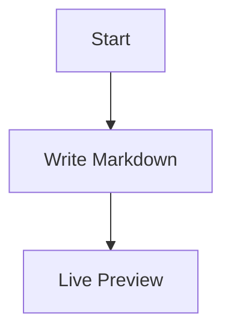

# MarkdownEditor

<p align="center">
  
</p>

MarkdownEditor 是一款简洁的原生 Markdown 编辑器，面向日常写作、技术笔记和文档预览场景。它提供实时预览、语法高亮、Mermaid 图表、图片拖拽/粘贴和文件夹浏览能力，主要支持 macOS， Windows真在逐步完善中。


## 主要特性

- **实时预览**：编辑 Markdown 时同步渲染 HTML 预览。
- **三栏工作区**：文件侧边栏、Markdown 编辑区、预览区清晰分离。
- **语法高亮**：编辑器内高亮标题、链接、代码、引用、图片等 Markdown 语法。
- **Mermaid 图表**：直接渲染 `mermaid` 代码块，无需额外配置。
- **代码块高亮**：预览区内置 highlight.js，适合技术文档写作。
- **图片嵌入**：支持拖拽或粘贴图片，并以 base64 写入 Markdown 文件。
- **搜索与替换**：支持全文搜索、结果跳转、替换和预览区搜索。
- **大纲导航**：根据标题生成文档大纲，快速跳转章节。
- **专注预览**：可隐藏编辑区，并切换不同预览宽度。
- **会话恢复**：自动恢复上次打开的文件。

## 系统要求

### macOS

- macOS 14.0 Sonoma 或更高版本
- Apple Silicon（arm64）

### Windows

- Windows 10 64-bit 或更高版本

## 安装

### macOS

1. 从 [Releases](https://github.com/your-org/MarkdownEditor/releases) 下载最新的 `MarkdownEditor.dmg`。
2. 打开 DMG，将 `MarkdownEditor.app` 拖入 `Applications` 文件夹。
3. 首次启动如被 Gatekeeper 拦截，请右键点击应用并选择 **打开**。

### Windows

1. 从 [Releases](https://github.com/your-org/MarkdownEditor/releases) 下载最新的 `MarkdownEditor.exe`。
2. 运行安装程序并按提示完成安装。

## 使用快捷键

| 操作 | macOS 快捷键 |
| --- | --- |
| 打开文件 | `Cmd+O` |
| 保存 | `Cmd+S` |
| 搜索 | `Cmd+F` |
| 新建笔记 | `Cmd+N` |
| 新建窗口 | `Cmd+Shift+N` |
| 显示/隐藏大纲 | `Cmd+Shift+O` |
| 预览专注模式 | `Cmd+Shift+P` |
| 显示/隐藏侧边栏 | `Cmd+Option+S` |
| 切换预览宽度 | `Cmd+W` |
| 粘贴图片 | `Cmd+V` |

## 常用功能

### Mermaid 图表

在 Markdown 中写入 `mermaid` 代码块即可渲染图表：

````markdown

````

### 图片拖拽与粘贴

将图片拖入编辑器，或从其他应用复制图片后按 `Cmd+V` 粘贴。图片会被写入 Markdown 文件本身，便于单文件保存和分享。

### 搜索与替换

按 `Cmd+F` 打开搜索面板，可在编辑区和预览区定位匹配结果；展开替换行后可执行单次替换或全部替换。

## 从源码构建

### macOS

```bash
git clone https://github.com/your-org/MarkdownEditor.git
cd MarkdownEditor

# 可选：安装 cmark-gfm 以获得更完整的 GFM 支持
brew install cmark-gfm

bash build.sh

# 可选：打包为 DMG
bash package.sh
```

构建完成后，`MarkdownEditor.app` 与可选的 `MarkdownEditor.dmg` 会生成在项目根目录。

### Windows

Windows 版本位于 `MarkdownEditor-windows/`，可使用该目录下的构建脚本或常规前端构建流程打包。

## 依赖说明

| 依赖 | 用途 | 是否内置 |
| --- | --- | --- |
| [Mermaid](https://mermaid.js.org/) | 图表渲染 | 是 |
| [highlight.js](https://highlightjs.org/) | 代码块高亮 | 是 |
| [cmark-gfm](https://github.com/github/cmark-gfm) | GFM Markdown 渲染 | 否，macOS 可选安装 |

未安装 `cmark-gfm` 时，应用会使用内置解析逻辑作为 fallback。

## 常见问题

### macOS 首次启动失败

如果系统提示应用无法打开，可右键选择 **打开**；必要时执行：

```bash
xattr -d com.apple.quarantine /Applications/MarkdownEditor.app
```

### Mermaid 无法加载

重新下载前端资源并构建：

```bash
bash download_mermaid.sh
bash build.sh
```

## License

MIT
